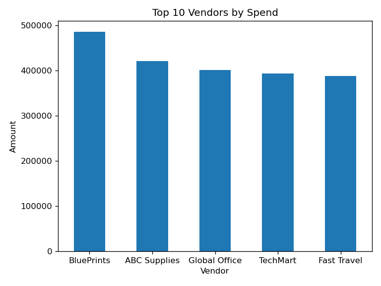
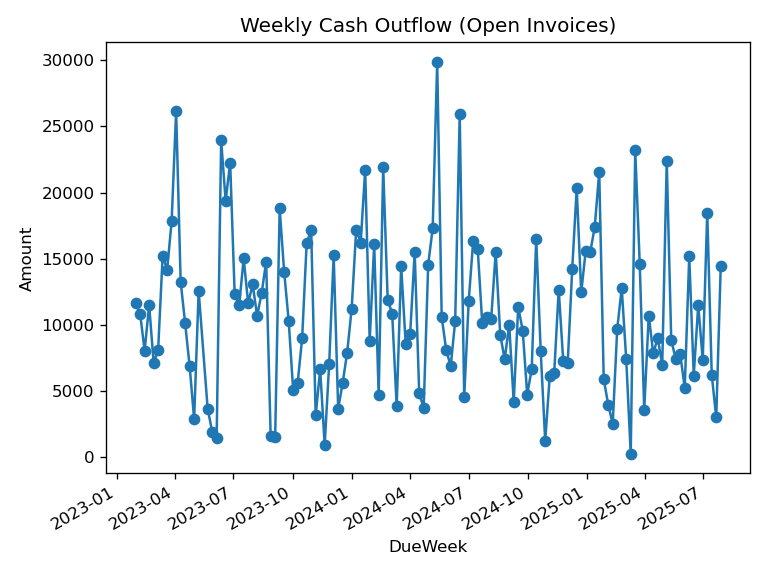

# Accounts Payable Analysis Project

This repository contains:
- Raw AP data
- Processed outputs
- Notebooks
- Source code
# 📊 AP Analysis (Dynamics 365 Style) — End-to-End Data Pipeline + Streamlit Dashboard

This project delivers a complete **Accounts Payable (AP) analytics workflow**, inspired by **Microsoft Dynamics 365 Finance & Operations**.  
It includes full **data cleaning**, **KPI calculations**, **automated CSV reports**, and an interactive **Streamlit dashboard** for real-time analysis.

---

## 🚀 Live Demo (Streamlit Web App)

Access the live deployed dashboard here:

🔗 **https://ap-analysis-d365-mitvjtrfz5m5vzhs2nyw8a.streamlit.app/**

---

## 📁 Project Structure

ap-analysis-d365/
│
├── app.py # Streamlit dashboard
├── ap_cleaning.py # Data cleaning pipeline
├── ap_kpis.py # KPI calculations
├── ap_reports.py # Automated reports (aging, vendors, cashflow)
│
├── data/
│ ├── raw/ # Raw Excel input files (ignored by git)
│ └── processed/ # Cleaned & transformed CSV output
│
├── reports/ # Dashboard screenshots & charts
│
├── requirements.txt
└── README.md


---

## 🧼 Data Cleaning Rules

The cleaning logic follows standard enterprise AP validation rules (similar to D365):

✅ Remove rows with missing **APID**  
✅ Remove zero or negative **Amount**  
✅ Convert all dates to valid `datetime`  
✅ Drop rows with invalid date formats  
✅ Remove rows where **DueDate < InvoiceDate**  
✅ Keep only valid currencies: `USD, EUR, GBP, CAD, AUD, JPY`  
✅ Detect and remove duplicates using a composite key:  
`APID + Vendor + InvoiceDate + Amount`  
✅ Save cleaned data as: `data/processed/ap_clean.csv`

Cleaning implementation lives in:


ap_cleaning.py


---

## 📈 Key Performance Indicators (KPIs)

The project computes a complete AP KPI suite:

### Core KPIs
- Total Invoices  
- Total Spend  
- Open Invoices  
- Overdue Invoices  
- Overdue Amount  
- Average Days Past Due (Avg DPD)  
- Maximum DPD  
- Vendor Count  
- Currency Breakdown  
- Open vs Paid distribution  

Generated via:


ap_kpis.py


---

## 📑 Automated Reports

Running `ap_reports.py` generates structured CSV reports:

| File | Description |
|------|-------------|
| `aging_open.csv` | Aging summary for open invoices |
| `top_vendors.csv` | Top 10 vendors ranked by spend |
| `cash_weekly.csv` | Weekly cash-out forecast based on DueDate |

---

## 🎛 Streamlit Dashboard

The dashboard includes:

✅ Vendor filter  
✅ Currency filter  
✅ Invoice date range picker  
✅ KPI cards  
✅ AP Aging chart  
✅ Top Vendors bar chart  
✅ Weekly Cash Outflow chart  
✅ Filtered data preview  
✅ One-click CSV export  

---

## 🖼 Screenshots

### AP Aging (Open Invoices)


### Top Vendors


### Weekly Cash Outflow


---

## 🛠 Local Execution

### 1) Create virtual environment
```bash
conda create -n ap-d365 python=3.10 -y
conda activate ap-d365
pip install -r requirements.txt
2) Place your raw Excel files here:
data/raw/

3) Run cleaning pipeline
python ap_cleaning.py

4) Generate KPIs
python ap_kpis.py

5) Generate reports
python ap_reports.py

6) Launch Streamlit dashboard
streamlit run app.py

🌐 Deployment (Streamlit Cloud)

Deployment settings:

Repository: <your-username>/ap-analysis-d365
Branch: main
Main file path: app.py

✅ Technologies Used

Python 3.10

Pandas

NumPy

Streamlit

OpenPyXL

Matplotlib (optional for visuals)

Git / GitHub

📄 License

MIT License — Free to use for learning, portfolio, and commercial projects.

👤 Author

[REYHANEH HAJILI]
Data Engineer & Data Analyst – Python & Microsoft Dynamics 365 Integration